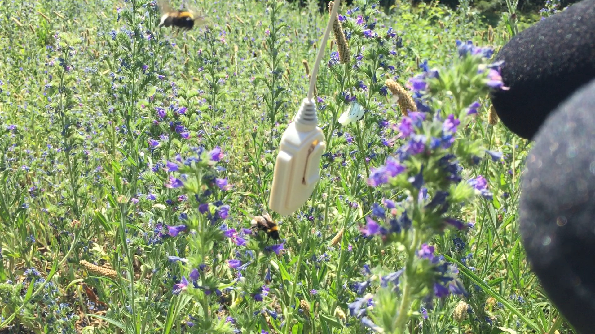

Replace a video audio track with a synchronized external audio.



# Installation

Requires Python 2.x (package audio-offset-finder is Python 2.x only).

`pip install -r requirements.txt --user`

or in virtual environment:

`pip install -r requirements.txt`


# Use

## python synchronize_video_audio.py

```
usage: synchronize_video_audio.py [-h] [--verbose VERBOSE] video audio output

Replace an audio track in a video file with a synchronized external audio track

positional arguments:
  video              Input video file
  audio              Input audio file
  output             Output video file

optional arguments:
  -h, --help         show this help message and exit
  --verbose VERBOSE  Verbose output (default: False)
```


## python batch_synchronize_video_audio.py

```
usage: batch_synchronize_video_audio.py [-h] video audio output

Batch replace audio tracks in video files with synchronized external audio
tracks. The tracks are sorted by last modification time.

positional arguments:
  video       Input video files directory
  audio       Input audio files directory
  output      Output video files directory

optional arguments:
  -h, --help  show this help message and exit
```
